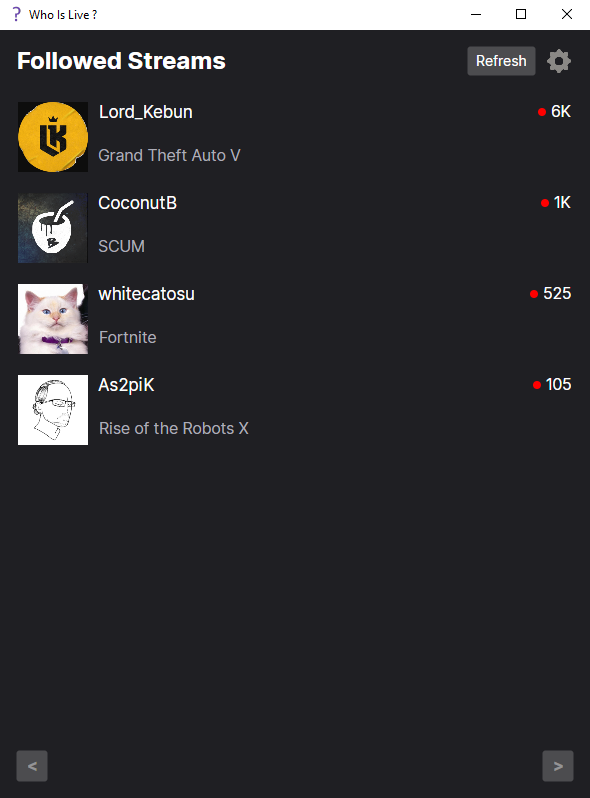

# Who Is Live?

Who Is Live is an application that allows you to see who is live on Twitch.tv & Open the stream in either your browser or in one of the supported media players.

The main reason this app exist is because Twitch's website is very slow, especially on low powered devices such as old computer, Raspberry Pi's and some Android devices.
There is a way to get a smoother experience, and it is by using 3rd party apps to open streams outside of the very slow browsers.
This app makes use of streamlink to achieve this! (https://streamlink.github.io/).

## Dependencies

- .NET 8 Desktop Runtime (https://dotnet.microsoft.com/download/dotnet/7.0) (Middle right of this page)

## Optional Dependencies

- Streamlink (https://streamlink.github.io/install.html) (If you want to open streams in VLC or MPV)
- VLC (https://www.videolan.org/vlc/) (If you want to open streams in VLC)
- MPV (https://mpv.io/installation/) (If you want to open streams in MPV)

## Notice

- No packages are provided for linux & MacOS, as i don't know how to make them, the linux version works, but you have to install it manually or not.
- Don't forgot to add execute permissions to the file if you want to run it.

## Features

### Cross Platform (Windows, Linux & Maybe MacOS)

- Android support is planned. But it should work the same as on Linux when using Termux.

### Twitch OAuth2 Authentication

  

### See who is live on Twitch.tv (In the same form as the expanded Twitch Sidebar)

  

### Set which players you want to use to open streams

  

### Set the quality you want to open streams within this list

  

### Remove Streamers from the list

  

### Localization Support via Resource Files (.resx)

- 2 Languages are currently supported:

  - English
  - French

### Pagination for performance 

(I haven't followed enough people to test it properly, but it should work)